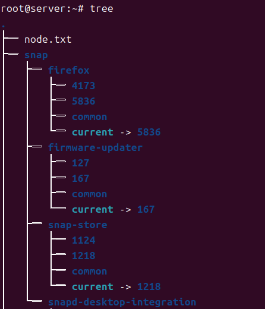

# vmware 단축키

## 화면에서 나가기
```
ctrl + alt
```


<hr>

# 설치 명령어

## tree
```
apt -y install tree
```


## genisoimage
```
apt -y install genisoimage
```

> iso 만들기 <br>

```
genisoimage -r -J -o boot.iso /boot
```

> 마운트 <br>
```
mount -o loop boot.iso /media/iso
```

> 마운트 해제 <br>
```
umount /media/iso
```

<hr>

# linux 명령어

## 종료
```
poweroff
halt -p
shutdown

-- 5분 후에 예약종료
shutdown -h +5

-- 예약종료 취소
shutdown -c

-- 사용자들에게 10분후에 종료한다는 메세지 전송
shutdown -k +10
```

## 재부팅
```
shutdown -r now
reboot
init 6
```

## 로그아웃
```
logout
exit
```

## 가상콘솔
```
ctrl + alt + f2 ~ f6 (f2는 x윈도우 모드)

만약 위의 키로 가상콘솔 변환이 안되는 경우
chvt 번호
를 입력하면 이동한다.
```

## 디렉터리 파일 출력
```
ls
ls -a
ls -l
ls -al
...
```

## 디렉터리 이동
```
cd /etc/systemd

-- 상위 디렉터리 이동
cd ..
```

## 현재 디렉터리의 전체 경로 출력
```
pwd
```

## 크기가 0인 파일 생성, 이미 존재하는 경우 수정
```
touch abc.txt
```

## 디렉터리 삭제 (사용에 주의)
```
rm -rf abc
```

## 파일, 디렉터리 복사
```
cp abc.txt cba.txt
```

## 파일과 디렉터리의 이름을 변경하거나 위치 이동
```
mv abc.txt www.txt
```

## 새로운 디렉터리 생성
```
mkdir abc
```

## 디렉터리 삭제 (비어있어야 동작)
```
rmdir abc
```

## 텍스트로 작성된 파일을 화면에 출력
```
cat a.txt b.txt
```

## 파일 내용의 앞 10행 또는 뒤 10행만 보이도록 설정
```
head /etc/systemd/user.conf
tail /etc/systemd/user.conf
```

## 텍스트로 작성된 파일을 화면에 페이지 단위로 출력
```
more /etc/systemd/system.conf
less /etc/systemd/system.conf
```

## 어떤 종류의 파일인지를 표시
```
file /etc/systemd/system.conf
```

## 터미널 화면을 깨끗하게 지워줌
```
clear
```

## 내가 쳤던 명령어들을 보여줌
```
history
```

## Runlevel
init 0 - 종료
init 1 - 시스템 복구
init 2, 3, 4 - mutiUser
init 5 - 그래픽 다중 사용자 모드
init 6 - reboot

## nano editor
```
alt + n - 행번호출력칟
```

## vim
i - 쓰기모드
esc, ctrl + c - 모드 나가기
:wq - 저장 후 종료
:q! - 변경하지 않고 종료

```
apt -y install vim
```

## gedit
> 파일을 메모장으로 열기
```
gedit /etc/apt/sources.list.d/ubuntu.sources
```

## mount
> cdrom 마운트 해제
```
unmount /dev/cdrom
```

# 사용자, 그룹 명령어
## adduser
> 새로운 사용자를 추가 <br>
```
adduser newuser1
```

## passwd
> 사용자의 비밀번호를 지정하거나 변경 <br>
```
adduser newuser1
```

## usermod
> 사용자의 속성 변경 <br>
```
usermod --groups ubuntu newuser1
```

## userdel
> 사용자 삭제 <br>
```
userdel newuser2
```

## chage
> 사용자의 암호를 주기적으로 변경하도록 설정 <br>
```
charge -m 2 newuser1
```

## groups
> 현재 사용자가 속한 그룹을 보여줌 <br>
```
groups
```

## groupadd
> 새로운 그룹 생성 <br>
```
groupadd newgroup1
```

## groupmod
> 그룹 속성 변경 <br>
```
groupmod --new-name mygroup1 newgroup1
```

## groupdel
> 그룹을 삭제 <br>
```
groupdel newgroup2
```

## gpasswd
> 그룹의 암호를 설정하거나, 그룹의 관리를 수행 <br>
```
gpasswd mygroup1
```

# 파일

## chgrp
> 그룹 변경 - chgrp 유저이름 (파일 혹은 디렉토리 이름) <br>
```
chgrp ubuntu testfile
```

## su - username
> 유저 변경 <br>
```
su - ubuntu
```

## mv file(dir)name username
> 해당 유저디렉토리로 파일이나 디렉토리 이동 <br>
```
mv testfile.txt ~ubuntu
```

# 링크

## 하드링크 생성
> 원본과 같은 파일, 원본 파일의 여부 상관없이 조회 가능 <br>
```
ln filename hardlink
```

## 소프트링크(심볼릭링크)
> 원본을 가리키는 파일, 원본과 다름, 원본파일이 없어지면 조회 불가가<br>
```
ln -s filename softlink
```

# 설치 명령어

## dpkg
> 의존성 문제 때문에 최근에는 잘 안쓰임 <br>
dpkg --info filename <br>

### 정보 확인
```
dpkg --info axel
```
### 설치
```
dpkg -i axel
```
### 설치된 패키지 확인
```
dpkg -l axel
```
### 설치된 패키지 제거
```
dpkg -r axel
```

## apt
> dpkg에 의존성 문제 때문에 만들어짐 <br>
apt-cache show filename <br>
### 정보확인
```
apt-cache show galculator
```

### 의존성 확인
```
apt-cache depends galculator
```

### 모든 의존성 확인해서 설치
```
apt -y install galculator
```

### 수정 내역 업데이트
```
apt update
```

### 업그레이드 할수있는 패키지 업그레이드
```
apt upgrade
```

## pip install
> 리눅스 22 이상부턴 그냥 쓰면 에러나서 가상환경에서 python 라이브러리를 설치해야 함

### 1. 가상환경 생성
```bash
sudo apt install python3-venv
python3 -m venv myenv
```

### 2. 가상환경 활성화
```bash
source /myenv/bin/activate
```

### 3. 필요 라이브러리 설치
> root계정 권한 필요

```bash
pip install requests
```

### 4. 가상환경 비활성화
```bash
deactivate
```